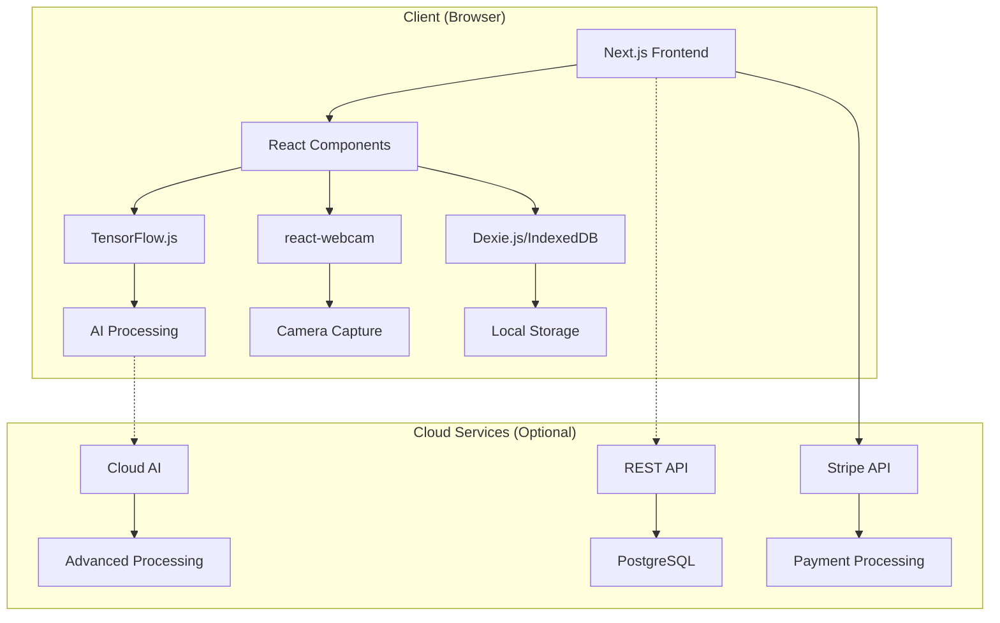
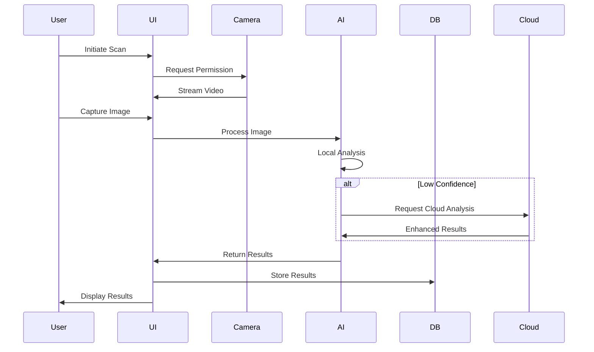
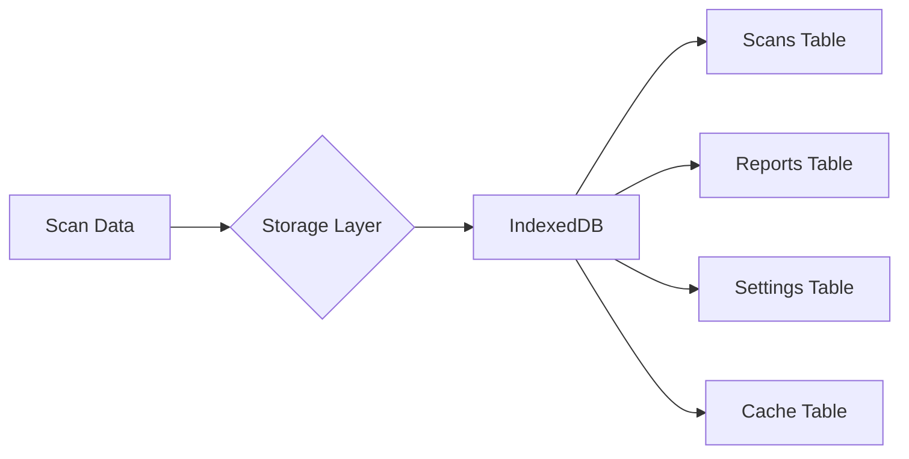
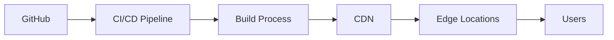

# VeriCard Scan Pro - Architecture Overview

## 🏗️ System Architecture

VeriCard Scan Pro is built as a modern web application using a local-first architecture that prioritizes user privacy and offline functionality.



## 📁 Project Structure

```
vericard-scan-pro/
├── apps/
│   ├── web/                    # Next.js web application
│   │   ├── src/
│   │   │   ├── app/           # App router pages
│   │   │   ├── components/    # React components
│   │   │   ├── services/      # Business logic
│   │   │   ├── hooks/         # Custom React hooks
│   │   │   └── utils/         # Utility functions
│   │   └── public/            # Static assets
│   │
│   └── api/                   # Backend API (future)
│       ├── src/
│       └── prisma/
│
├── libs/                      # Shared libraries
│   ├── core/                  # Core business logic
│   │   ├── src/
│   │   │   ├── models/       # Data models
│   │   │   ├── validators/   # Input validation
│   │   │   └── constants/    # Shared constants
│   │   └── package.json
│   │
│   └── ai/                    # AI/ML functionality
│       ├── src/
│       │   ├── models/       # TensorFlow models
│       │   ├── processors/   # Image processing
│       │   └── analyzers/    # Card analysis
│       └── package.json
│
├── docs/                      # Documentation
├── scripts/                   # Build/utility scripts
└── infra/                     # Infrastructure config
```

## 🔧 Technology Stack

### Frontend
- **Framework**: Next.js 14 (App Router)
- **Language**: TypeScript 5.3+
- **UI Library**: React 18
- **Styling**: Tailwind CSS + Radix UI
- **State Management**: React Context + Hooks
- **Camera**: react-webcam
- **Database**: Dexie.js (IndexedDB wrapper)

### AI/ML
- **Framework**: TensorFlow.js
- **Models**: Custom trained for card detection
- **Processing**: Client-side inference
- **Fallback**: Optional cloud API

### Infrastructure
- **Monorepo**: pnpm workspaces
- **Build**: Turbo (future)
- **Testing**: Jest + Playwright
- **CI/CD**: GitHub Actions
- **Deployment**: Vercel/Netlify

## 🏛️ Key Design Principles

### 1. Local-First Architecture
- All data processing happens in the browser
- No required internet connection for core features
- User data never leaves device without explicit consent
- IndexedDB for persistent local storage

### 2. Progressive Enhancement
- Basic features work on all modern browsers
- Advanced features (AI, camera) gracefully degrade
- Cloud services are optional enhancements

### 3. Privacy by Design
- No tracking or analytics by default
- All data encrypted in local storage
- Explicit user consent for any cloud sync
- Data export/import capabilities

### 4. Performance Optimization
- Code splitting for faster initial load
- Lazy loading of AI models
- Service worker for offline support
- Optimistic UI updates

## 🔄 Data Flow

### Scanning Workflow


### Data Storage


## 🔐 Security Architecture

### Client-Side Security
- Content Security Policy (CSP)
- Subresource Integrity (SRI)
- HTTPS enforcement
- Input sanitization

### Data Security
- IndexedDB encryption (planned)
- Secure key storage
- No sensitive data in localStorage
- Memory cleanup after processing

### API Security (Future)
- JWT authentication
- Rate limiting
- API key rotation
- CORS configuration

## 🚀 Deployment Architecture

### Web App Deployment


### Scaling Strategy
1. **Static Generation**: Pre-render marketing pages
2. **Edge Functions**: API routes at edge locations
3. **CDN**: Assets served from global CDN
4. **Local Processing**: Computation on user devices

## 📊 Performance Targets

| Metric | Target | Current |
|--------|--------|---------|
| Initial Load | < 3s | TBD |
| Time to Interactive | < 5s | TBD |
| Scan Processing | < 1s | ~0.8s |
| Report Generation | < 3s | TBD |

## 🔄 Future Architecture Enhancements

### Phase 1: Current (Local-Only)
- Browser-based processing
- IndexedDB storage
- No backend required

### Phase 2: Hybrid (Planned)
- Optional cloud sync
- Enhanced AI models
- Multi-device support
- Real-time collaboration

### Phase 3: Enterprise (Future)
- Self-hosted options
- Advanced analytics
- Team management
- API access

## 🧩 Integration Points

### Payment Processing
- Stripe Checkout for subscriptions
- Webhook handling for payment events
- Subscription status in IndexedDB

### Export/Import
- JSON format for data portability
- CSV export for reports
- PDF generation for documents

### Third-Party Services
- Stripe (payments)
- Vercel/Netlify (hosting)
- GitHub (version control)
- npm/pnpm (package management)

---

This architecture is designed to be simple, scalable, and respectful of user privacy while delivering a powerful card verification platform.