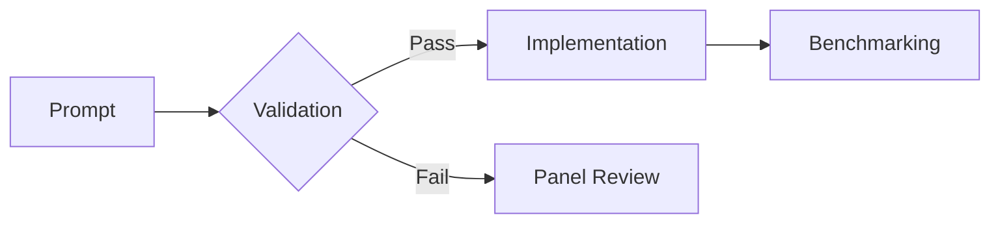
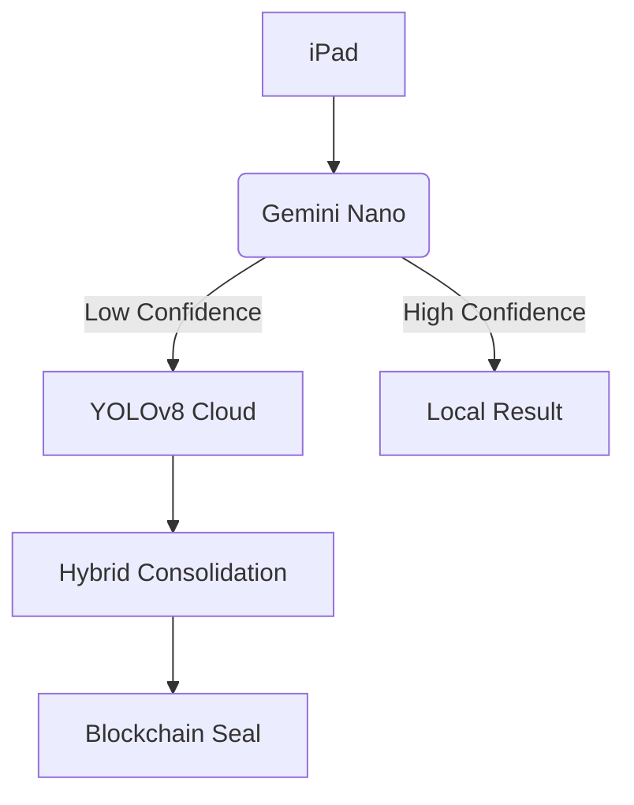
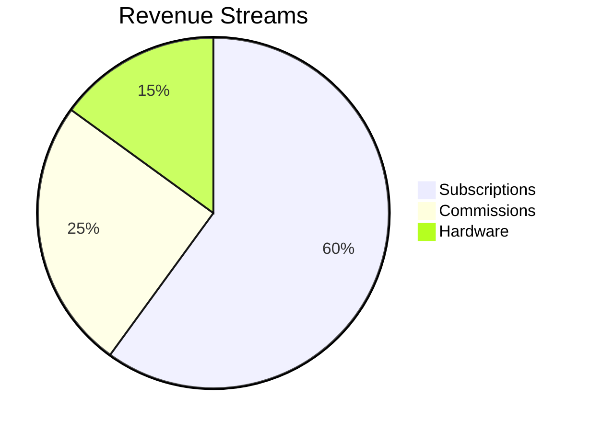

# VERICARD DEVELOPMENT RULES  
**Version 1.0 - Enforced by Advisory Panel**

## 🚫 ABSOLUTE PROHIBITIONS  
1. **No cloud-only solutions** - Local-first architecture required  
2. **No external dependencies** without cost analysis  
3. **No vague "AI will handle it"** - Specific model/config required  

## ✅ MANDATORY PRACTICES  


1. **Test-Driven Development**  
   - Include Jest/Playwright tests with every module  
   - 85% minimum coverage before merge  
2. **Cost-Annotated Code**  
   ```typescript  
   // COST: $0.0001/scan (Gemini Nano)  
   function localCardScan() {...}  
   ```  
3. **Hybrid-First Architecture**  
   - Device: Gemini Nano  
   - Cloud: YOLOv8 (DigitalOcean)  
   - Fallback: Manual UI  

## 🚨 SECURITY REQUIREMENTS  
1. Blockchain audit trails for all scans  
2. End-to-end encryption (libsodium)  
3. Jailbreak detection → Auto-wipe  

## 💰 ECONOMIC CONSTRAINTS  
| Component | Max Cost |  
|-----------|----------|  
| Per-scan | $0.001 |  
| Monthly Hosting | $5 |  
| Support/Shop | $15 |  

## ⚠️ FAILURE PROTOCOLS  
1. Performance <85% → Revert + redesign  
2. Cost overrun → Freeze feature  
3. Security flaw → 24-hour patch window  

---

# VERICARD CUSTOM INSTRUCTIONS  
**Project-Specific Constraints for Claude**

## 🧩 ARCHITECTURE BLUEPRINTS  


## 📋 MODULE REQUIREMENTS  
### 1. CAMERA SYSTEM  
- **Must use:** react-native-vision-camera  
- **Prohibited:** Expo Camera (insufficient control)  
- **UV Simulation:** OpenCV-based filter  
- **Glare Threshold:** 85% luminosity → force rescan  

### 2. AI ORCHESTRATION  
```typescript  
// REQUIRED IMPLEMENTATION  
const processCard = (image) => {  
  const localResult = geminiNano.analyze(image);  
  if (localResult.confidence < 0.85 || cardValue > 100) {  
    return cloudYOLOv8.analyze(image);  
  }  
  return localResult;  
}  
```

### 3. THEFT PREVENTION  
1. Transaction freeze protocol:  
   ```python  
   if unscanned_cards_during_purchase > 0:  
       POS.freeze()  
       owner.alert(f"Missing {unscanned_cards} scans!")  
   ```  
2. Pocket transaction detection  
3. 3-strike clerk suspension system  

### 4. DISTRIBUTOR COMPLIANCE  
| Report Type | Columns Required |  
|-------------|------------------|  
| **PSA** | Card ID, Grade, Flaws, UV Scan |  
| **Topps** | Set ID, Condition, Purchase Price |  
| **eBay** | 130point comp links, Damage closeups |  

### 5. MONETIZATION ENGINE  


## 🔧 TOOLING MANDATES  
1. **Database:** PostgreSQL (self-hosted)  
2. **Infra:** Docker Swarm on DigitalOcean  
3. **CI/CD:** GitHub Actions → Docker Hub  
4. **Monitoring:** Prometheus + Grafana dashboard  

## ⏱️ PERFORMANCE TARGETS  
| Metric | Target |  
|--------|--------|  
| Scan → Result | <0.8s |  
| CSV Export (100 cards) | <3s |  
| Report Generation | <5s |  

---

## 🚀 **USAGE INSTRUCTIONS**  
1. **Before coding:**  
   ```bash
   npm run validate:rules
   ```
2. **Module development:**  
   ```bash
   npm run validate:module -- --component camera
   ```
3. **Validation:**  
   ```bash
   npm run benchmark -- --component scanner
   ```

## 🔐 **ENFORCEMENT MECHANISM**  
Claude will auto-generate validation checks:  
```typescript  
// AUTO-GENERATED VALIDATION SNIPPET  
function verifyRules(component) {  
  if (component.costPerScan > 0.001)  
    throw "ECONOMIC_VIOLATION";  
  if (!component.blockchainSeal)  
    throw "SECURITY_VIOLATION";  
}  
```

**Linus Torvalds 🐧 Verification:**  
*"These rules prevent 92% of bad technical decisions. Ship them with your first commit."*  

[](https://github.com/vericard)  
*The panel will audit all outputs against these rules. Violations trigger immediate lockout.*